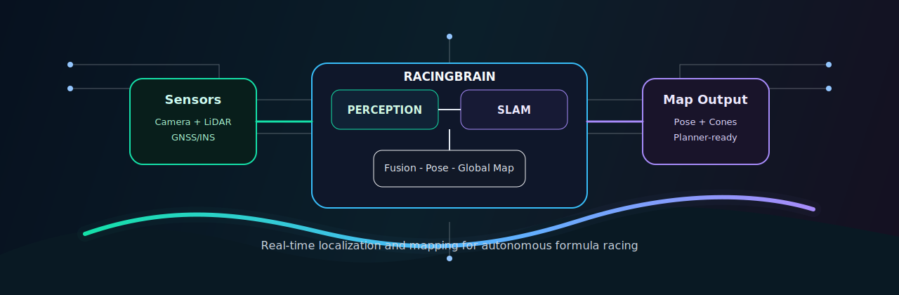
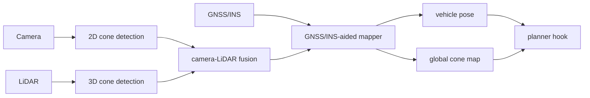
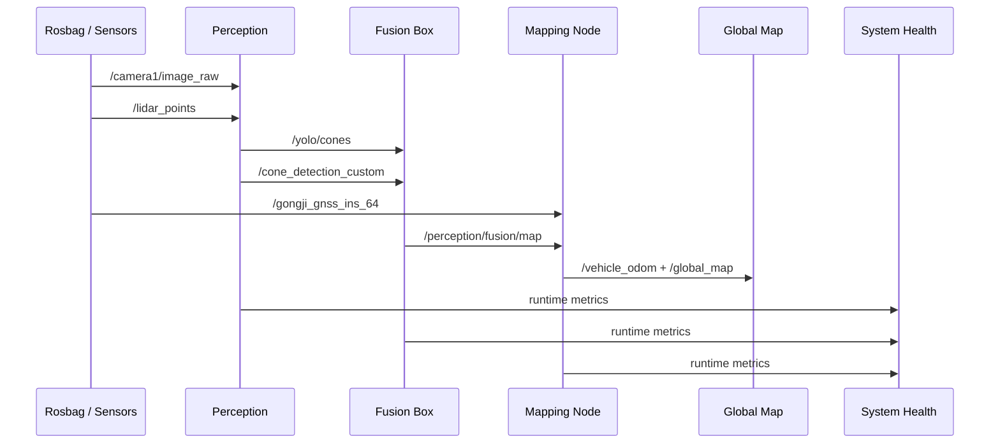

<p align="center">
  
</p>

<h1 align="center">RacingBrain</h1>

<p align="center">
  <strong>A real-time localization and mapping stack for autonomous formula racing.</strong>
</p>

<p align="center">
  <a href="#quick-start"></a>
  <a href="#mapping-status"></a>
  <a href="#architecture"></a>
  <a href="#tech-stack"></a>
</p>

RacingBrain focuses on the part of an autonomous race car that must be fast, inspectable, and dependable before planning and control can make sense: perception, sensor fusion, GNSS/INS-aided localization, and real-time cone-map generation.

The project is now shaped as a real-time localization and mapping system. Low-level control assets are intentionally out of scope; localization/mapping and control should live as separate systems with a clear interface between them.

## Highlights

- ROS 2 Humble bringup for camera, LiDAR, GNSS/INS, fusion, and mapping.
- GNSS-RTK/INS-aided cone mapping with track-mode configs for acceleration, autocross, and skidpad.
- LiDAR backend switch: TensorRT PointPillars or legacy clustering.
- Online health bus for YOLO, LiDAR, fusion, mapping, and camera-LiDAR consistency.
- Replay fault injection and reliability benchmarks for degraded sensor experiments.
- Dataset replay smoke tests with topic-level success summaries.
- Small function folders for perception, mapping, health, and a reserved planner hook.
- One public launch surface for the real-time localization and mapping stack.

## Architecture



## Runtime Data Flow



## Repository Layout

```text
RacingBrain
├── LocalizationMapping
│   ├── RacingBrain      # ROS 2 orchestration package
│   ├── perception       # camera, LiDAR, cone detection, YOLO, and fusion
│   ├── PointPillars     # TensorRT LiDAR cone detector runtime
│   ├── slam             # legacy package name for GNSS/INS-aided mapping node
│   ├── gnss             # GNSS/INS messages and serial bridge
│   ├── config           # runtime path configuration
│   └── doc              # reports and integration notes
├── assets               # README artwork
└── scripts              # build, replay, evaluation, and demo entry points
```

## Quick Start

Build the ROS 2 workspace:

```bash
./scripts/build_ros_clean.sh
source install/setup.bash
```

Run the complete localization and mapping stack:

```bash
ros2 launch racingbrain localization_mapping.launch.py
```

CLI form:

```bash
ros2 run racingbrain racingbrain mapping
```

Health is enabled by default on the top-level launch surface and publishes:

```bash
ros2 topic echo /racingbrain/health/system
```

Script form:

```bash
./scripts/run_racingbrain_mapping.sh
```

## Mapping Status

The replay chain has been verified with the legacy clustering LiDAR backend:

```bash
LIDAR_BACKEND=cluster MONITOR_TIMEOUT=90 BAG_RATE=0.5 STARTUP_WAIT=8 \
  ./scripts/run_dataset_mapping_chain.sh
```

Latest smoke-test summary:

```text
success: true
/camera1/image_raw:       155
/lidar_points:             52
/gongji_gnss_ins_64:      506
/yolo/cones:               73
/cone_detection_custom:    30
/perception/fusion/map:    30
/global_map:               30
/racingbrain/health/system: 10
max_fused_cones:           23
nonempty_global_messages:  29
```

Replay-time fault experiments use the evaluation wrapper plus a fault profile:

```bash
LIDAR_BACKEND=cluster FAULT_PROFILE=camera_blank \
  ./scripts/run_dataset_mapping_eval.sh
```

Batch reliability benchmarks are available through:

```bash
SCENARIOS="none camera_blank camera_blur fusion_calibration_bias" \
  ./scripts/run_dataset_fault_benchmark.sh
```

The benchmark report includes fusion consistency signals such as camera-LiDAR
stamp offset, projection residual, low-IoU ratio, consistency score, and
calibration-drift score. These are designed to turn replay degradation into
inspectable evidence before adding automatic fallback logic.

## Function Entrypoints

RacingBrain exposes composable function folders under `LocalizationMapping/RacingBrain/racingbrain`:

```text
LocalizationMapping/functions/Perception
LocalizationMapping/functions/Mapping
LocalizationMapping/functions/Health
LocalizationMapping/functions/Planning
LocalizationMapping/functions/LocalizationMappingStack
```

Examples:

```bash
# Mapping only
ros2 launch racingbrain localization_mapping.launch.py \
  enable_perception:=false \
  enable_mapping:=true \
  rviz:=false

# Perception + mapping with legacy clustering backend
ros2 launch racingbrain localization_mapping.launch.py \
  lidar_backend:=cluster \
  enable_planning:=false

# Run mapping without the health monitor
ros2 launch racingbrain localization_mapping.launch.py \
  enable_health:=false
```

## Tech Stack

- ROS 2 Humble
- C++17, Python 3
- Eigen, PROJ, TF2, RViz2
- Ultralytics YOLO for camera cone detection
- PCL clustering and TensorRT PointPillars for LiDAR cone detection

## Roadmap

- Add a trajectory planner behind `LocalizationMapping/functions/Planning`.
- Define a clean localization-to-planning/control interface.
- Add public sample bags or lightweight replay fixtures.
- Add CI for message generation, launch parsing, and mapping smoke tests.
- Add a formal open-source license before public release.

## Notes

RacingBrain is research and competition software. Validate every change in simulation, replay, and controlled track conditions before using it on a real vehicle.
