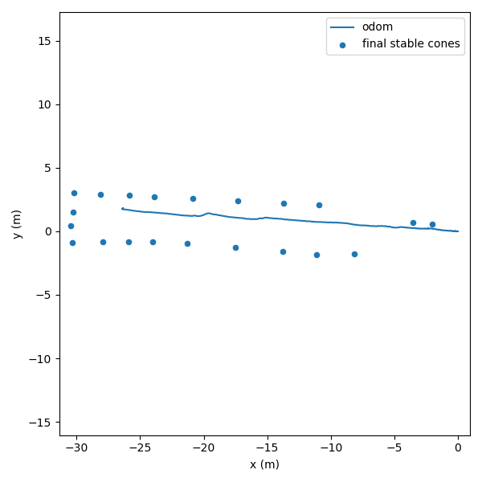
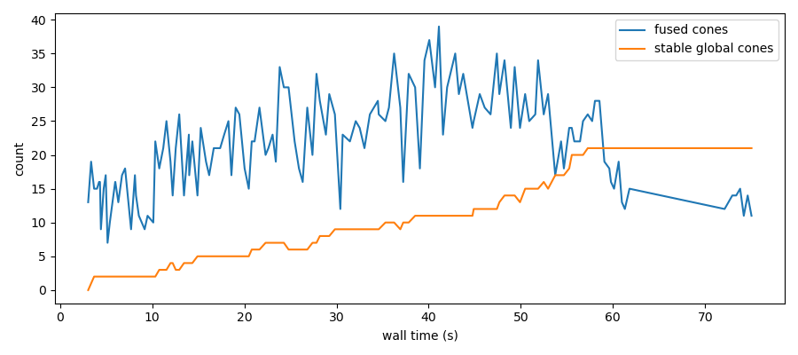
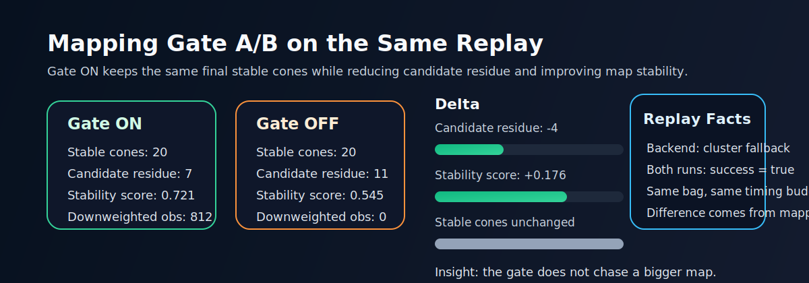
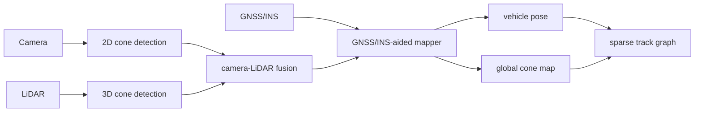
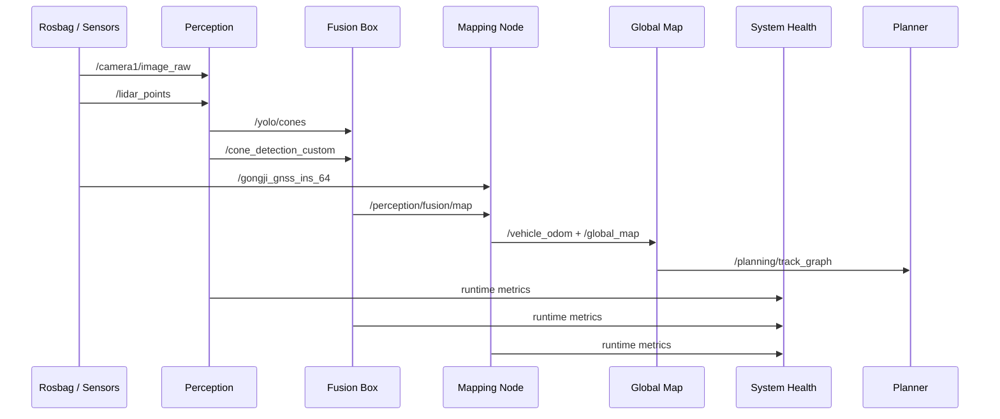

<p align="center">
  
</p>

<h1 align="center">RacingBrain</h1>

<p align="center">
  <strong>A real-time localization and mapping stack for autonomous formula racing.</strong>
</p>

<p align="center">
  <a href="README.md"><strong>English</strong></a> ·
  <a href="README.zh-CN.md"><strong>简体中文</strong></a>
</p>

<p align="center">
  <a href="#quick-start"></a>
  <a href="#mapping-status"></a>
  <a href="#architecture"></a>
  <a href="#tech-stack"></a>
</p>

RacingBrain focuses on the part of an autonomous race car that must be fast,
inspectable, and dependable before planning and control can make sense:
perception, sensor fusion, GNSS/INS-aided localization, real-time cone-map
generation, and a planning-facing sparse track graph.

The core question is practical and research-oriented: how can a high-speed
vehicle use fast learned perception while still knowing when that perception is
unsafe to trust? RacingBrain treats reliability as a runtime signal. It can
fall back from PointPillars to clustering, score camera-LiDAR consistency, gate
map updates under degraded perception, and quantify whether bad detections are
polluting the global map.

## Highlights

- ROS 2 Humble bringup for camera, LiDAR, GNSS/INS, fusion, and mapping.
- GNSS-RTK/INS-aided cone mapping with track-mode configs for acceleration, autocross, and skidpad.
- LiDAR backend switch: TensorRT PointPillars, legacy clustering, or automatic fallback.
- Online health bus for YOLO, LiDAR, fusion, mapping, and camera-LiDAR consistency.
- Runtime perception failure state for learning-path degradation and LiDAR backend arbitration.
- Risk-aware mapping gate that downweights unreliable observations and can freeze new-cone creation.
- Stable/candidate/rejected map layers for planning safety and replay diagnosis.
- Sparse cone-track graph and centerline preview interface for future planners.
- Replay fault injection and reliability benchmarks for degraded sensor experiments.
- Dataset replay smoke tests with topic-level success summaries.
- Small function folders for perception, mapping, health, planning, and full-stack bringup.
- One public launch surface for the real-time localization and mapping stack.

## Research Spine

RacingBrain is not a parameter-polishing demo. The current mainline turns a
legacy mapping stack into a reliability-aware intelligent racing system:

| Layer | Engineering move | Research value |
|---|---|---|
| Learning perception | PointPillars/YOLO path with clustering fallback | Fast learned detection without assuming learned models never fail |
| Failure judgement | Online backend, health, and camera-LiDAR consistency state | Converts distribution shift and calibration drift into runtime evidence |
| Mapping protection | Risk-aware gate and confidence map layers | Prevents transient perception failure from becoming long-lived map pollution |
| Evaluation | Fault injection and A/B map-pollution benchmark | Shows reliability claims with replay evidence instead of screenshots |
| Planning interface | Sparse track graph from stable cones | Keeps downstream planning input conservative and inspectable |

## Visual Results

<table>
  <tr>
    <td width="50%">
      
      <p align="center"><sub>Replay trajectory with final stable cone map.</sub></p>
    </td>
    <td width="50%">
      
      <p align="center"><sub>Stable cone count grows online instead of appearing all at once.</sub></p>
    </td>
  </tr>
</table>

<p align="center">
  
</p>

## Architecture



## Runtime Data Flow



## Repository Layout

```text
RacingBrain
├── LocalizationMapping
│   ├── RacingBrain      # ROS 2 orchestration package
│   ├── perception       # camera, LiDAR, cone detection, YOLO, and fusion
│   ├── PointPillars     # TensorRT LiDAR cone detector runtime
│   ├── slam             # legacy package name for GNSS/INS-aided mapping node
│   ├── gnss             # GNSS/INS messages and serial bridge
│   ├── config           # runtime path configuration
│   └── doc              # reports and integration notes
├── assets               # README artwork
└── scripts              # build, replay, evaluation, and demo entry points
```

## Quick Start

Build the ROS 2 workspace:

```bash
./scripts/build_ros_clean.sh
source install/setup.bash
```

Run the complete localization and mapping stack:

```bash
ros2 launch racingbrain localization_mapping.launch.py
```

CLI form:

```bash
ros2 run racingbrain racingbrain mapping
```

Health is enabled by default on the top-level launch surface and publishes:

```bash
ros2 topic echo /racingbrain/health/system
```

Script form:

```bash
./scripts/run_racingbrain_mapping.sh
```

## Mapping Status

The replay chain has been verified with the legacy clustering LiDAR backend:

```bash
LIDAR_BACKEND=cluster MONITOR_TIMEOUT=90 BAG_RATE=0.5 STARTUP_WAIT=8 \
  ./scripts/run_dataset_mapping_chain.sh
```

Latest smoke-test summary:

```text
success: true
/camera1/image_raw:       155
/lidar_points:             52
/gongji_gnss_ins_64:      506
/yolo/cones:               73
/cone_detection_custom:    30
/perception/fusion/map:    30
/global_map:               30
/racingbrain/health/system: 10
max_fused_cones:           23
nonempty_global_messages:  29
```

Recent reliability and planning-interface checks:

| Check | Command scope | Result |
|---|---|---|
| ROS build | `./scripts/build_ros_clean.sh` | 11 packages built |
| Mapping gate A/B | `SCENARIOS=none GATE_VARIANTS="true false"` | stable cones 20/20, candidate residue 7 vs 11, stability score 0.721 vs 0.545 |
| Map confidence layers | `LIDAR_BACKEND=auto MAPPING_GATE=true` | `/global_map`, `/mapping/candidate_cones`, `/mapping/rejected_observations` all 133 frames |
| Planning interface | `ENABLE_PLANNING=true LIDAR_BACKEND=auto` | `/planning/track_graph` 138 frames, planning state 138 frames, ready 84 frames |

Replay-time fault experiments use the evaluation wrapper plus a fault profile:

```bash
LIDAR_BACKEND=cluster FAULT_PROFILE=camera_blank \
  ./scripts/run_dataset_mapping_eval.sh
```

Batch reliability benchmarks are available through:

```bash
SCENARIOS="none camera_blank camera_blur fusion_calibration_bias" \
  ./scripts/run_dataset_fault_benchmark.sh
```

The benchmark report includes fusion consistency signals such as camera-LiDAR
stamp offset, projection residual, low-IoU ratio, consistency score, and
calibration-drift score. These are designed to turn replay degradation into
inspectable evidence before adding automatic fallback logic.

Mapping-gate ablations can be run on the same replay slice:

```bash
SCENARIOS="none camera_blank" GATE_VARIANTS="true false" \
  ./scripts/run_dataset_fault_benchmark.sh
```

The generated `mapping_gate_comparison.csv` reports whether the risk-aware gate
reduces map pollution: candidate residue, duplicate pairs, unstable cone
creation, and the replay stability score.

## Why It Feels Fresh

The mainline is already beyond a plain replay-only student stack:

- It treats learned perception as useful but fallible, instead of assuming the
  detector output is always trustworthy.
- It exposes runtime evidence for failure judgement: backend selection,
  calibration drift signals, latency, consistency, and health state.
- It protects the long-lived map instead of only scoring the detector.
- It has started the next bridge toward racing: a conservative planning-facing
  sparse track graph derived from the stable cone map.

## Function Entrypoints

RacingBrain exposes composable function folders under
`LocalizationMapping/RacingBrain/racingbrain/LocalizationMapping/functions`:

```text
Perception
Mapping
Health
Planning
LocalizationMappingStack
```

Examples:

```bash
# Mapping only
ros2 launch racingbrain localization_mapping.launch.py \
  enable_perception:=false \
  enable_mapping:=true \
  rviz:=false

# Perception + mapping with legacy clustering backend
ros2 launch racingbrain localization_mapping.launch.py \
  lidar_backend:=cluster \
  enable_planning:=false

# Perception + mapping with learning backend arbitration
ros2 launch racingbrain localization_mapping.launch.py \
  lidar_backend:=auto \
  enable_planning:=false

# Run mapping without the health monitor
ros2 launch racingbrain localization_mapping.launch.py \
  enable_health:=false

# Enable the sparse track graph interface
ros2 launch racingbrain localization_mapping.launch.py \
  lidar_backend:=auto \
  enable_planning:=true
```

When `lidar_backend:=auto` is used, PointPillars is treated as the preferred
learning backend and PCL clustering as the conservative fallback. The arbiter
publishes the selected stream to `/cone_detection_custom` and reports its
decision state on `/racingbrain/perception/failure_state`.

Mapping consumes the failure state through a risk-aware gate. Under degraded
perception it keeps updating existing cones with lower weight; under severe
runtime risk it can stop creating new cones so transient perception failures do
not pollute the stable global map.

The mapper publishes map layers with different confidence semantics:

```text
/global_map                    stable cone map for downstream consumers
/mapping/candidate_cones       low-confidence tracked cones still being tested
/mapping/rejected_observations per-frame observations rejected by ROI, lock, or risk gate
```

This keeps the planning-facing map conservative while still exposing the
candidate and rejection evidence needed for replay analysis and debugging.

When `enable_planning:=true`, RacingBrain starts a lightweight planning
interface that converts the stable cone map into a sparse track graph:

```text
/planning/track_graph              boundary pairs and centerline preview
/racingbrain/planning/input_state  JSON status for downstream planners
```

The node pairs blue cones with red/yellow cones, publishes a centerline preview,
and reports whether enough paired boundary points exist for a planner to consume.

## Tech Stack

- ROS 2 Humble
- C++17, Python 3
- Eigen, PROJ, TF2, RViz2
- Ultralytics YOLO for camera cone detection
- PCL clustering and TensorRT PointPillars for LiDAR cone detection

## Roadmap

- Add a racing trajectory planner behind the current sparse track graph interface.
- Define and document the localization/mapping-to-control contract.
- Add public sample bags or lightweight replay fixtures.
- Add CI for message generation, launch parsing, and mapping smoke tests.
- Add a formal open-source license before public release.

## Research Report

The research-facing entry point is
[`LocalizationMapping/doc/research_report.md`](LocalizationMapping/doc/research_report.md).
It explains the current insight chain, the paper-driven ideas behind the
reliability modules, and the next experiments that would make this project
stronger for intelligent racing and embodied autonomous systems.

## Recent Literature Hooks

These recent papers are especially relevant to the current direction:

- [Robustness Evaluation of Localization Techniques for Autonomous Racing (2024)](https://arxiv.org/abs/2401.07658):
  racing localization should be judged under slip and aggressive dynamics, not
  only under nominal conditions.
- [Resilient Sensor Fusion Under Adverse Sensor Failures via Multi-Modal Expert Fusion (CVPR 2025)](https://openaccess.thecvf.com/content/CVPR2025/html/Park_Resilient_Sensor_Fusion_Under_Adverse_Sensor_Failures_via_Multi-Modal_Expert_CVPR_2025_paper.html):
  robustness comes from modality-aware fallback rather than one fused path.
- [Cost-Sensitive Uncertainty-Based Failure Recognition for Object Detection (UAI 2024)](https://proceedings.mlr.press/v244/kassem-sbeyti24a.html):
  failure judgement should be budgeted and cost-sensitive, not a single fixed
  confidence threshold.
- [Perceive With Confidence (CoRL 2025)](https://proceedings.mlr.press/v270/dixit25a.html):
  uncertainty should be calibrated so downstream planning can inherit a safety
  interpretation.
- [A re-calibration method for object detection with multi-modal alignment bias in autonomous driving (2024)](https://arxiv.org/abs/2405.16848):
  small calibration bias can seriously hurt fusion detection and should be
  monitored or corrected online.
- [Curvature-Integrated MPCC for Autonomous Racing (2025)](https://arxiv.org/abs/2502.03695):
  once the sparse track graph is stable enough, curvature-aware local planning
  becomes a natural next step for lap-time improvement.

## Notes

RacingBrain is research and competition software. Validate every change in simulation, replay, and controlled track conditions before using it on a real vehicle.
