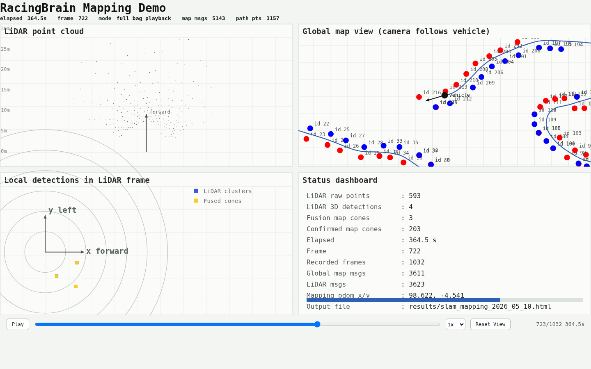
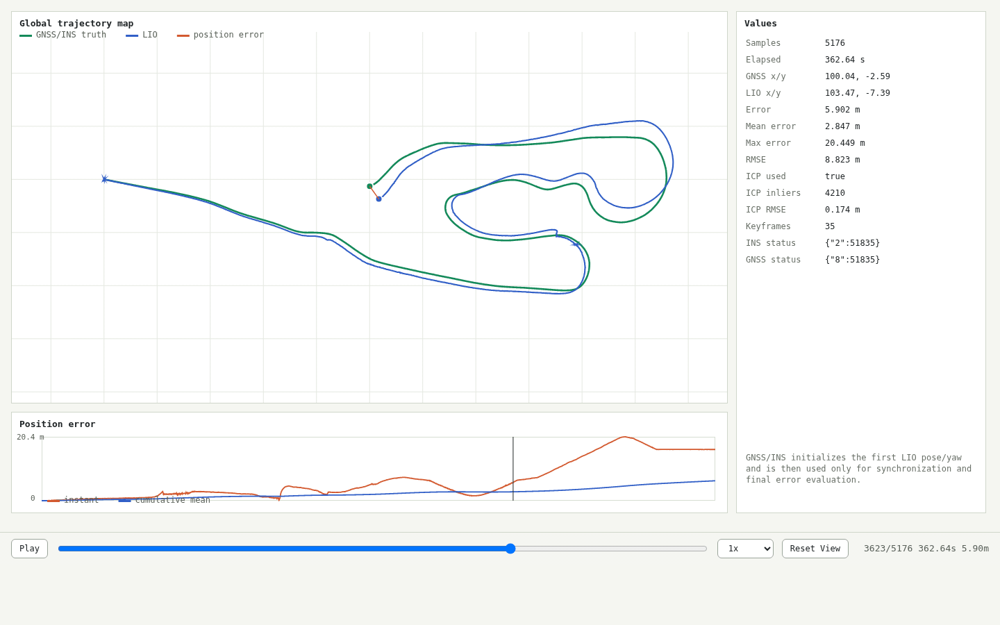
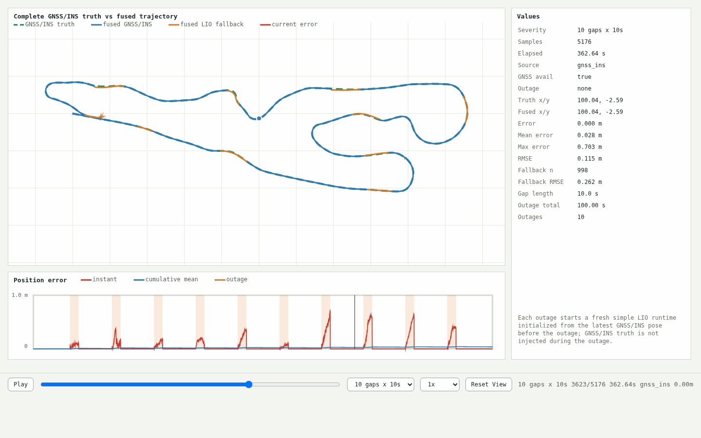

# RacingBrain 定位评估结果

这个仓库保留了 3 个可交互 HTML 结果。GitHub 的 README 会过滤 `iframe`，因此这里使用 GitHub 可点击预览链接嵌入入口；如果在线预览加载较慢，可以 clone 仓库后直接用浏览器打开对应 HTML。

| 项目 | HTML 预览 | 仓库内文件 |
| --- | --- | --- |
| 纯 GNSS/INS | [打开预览](https://htmlpreview.github.io/?https://github.com/yupengsky/RacingBrain/blob/main/results/slam_mapping_2026_05_10-15_02_50.html) | [results/slam_mapping_2026_05_10-15_02_50.html](results/slam_mapping_2026_05_10-15_02_50.html) |
| LIO GNSS/INS 评估 | [打开预览](https://htmlpreview.github.io/?https://github.com/yupengsky/RacingBrain/blob/main/results/simple_lio_2026_05_10-15_02_50.html) | [results/simple_lio_2026_05_10-15_02_50.html](results/simple_lio_2026_05_10-15_02_50.html) |
| FUSE | [打开预览](https://htmlpreview.github.io/?https://github.com/yupengsky/RacingBrain/blob/main/results/fuse_eval_2026_05_10-15_02_50.html) | [results/fuse_eval_2026_05_10-15_02_50.html](results/fuse_eval_2026_05_10-15_02_50.html) |

## 后程动图预览

### 纯 GNSS/INS



### LIO GNSS/INS 评估



### FUSE



## 本地打开

```bash
xdg-open results/slam_mapping_2026_05_10-15_02_50.html
xdg-open results/simple_lio_2026_05_10-15_02_50.html
xdg-open results/fuse_eval_2026_05_10-15_02_50.html
```

## 运行命令

完整复现命令见 [READ_TODO.md](READ_TODO.md)。
