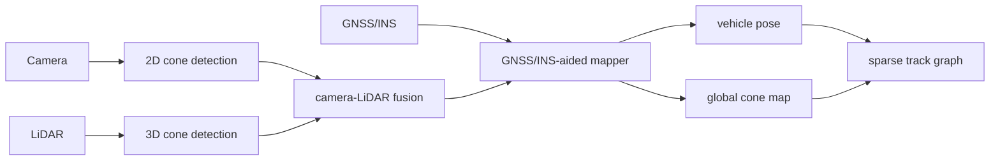

<p align="center">
  
</p>

<h1 align="center">RacingBrain</h1>

<p align="center">
  <strong>面向无人智能赛车的实时定位、建图与可靠性增强工程。</strong>
</p>

<p align="center">
  <a href="README.md"><strong>English</strong></a> ·
  <a href="README.zh-CN.md"><strong>简体中文</strong></a>
</p>

<p align="center">
  <a href="#快速开始"></a>
  <a href="#当前进展"></a>
  <a href="#研究主线"></a>
  <a href="#技术栈"></a>
</p>

RacingBrain 的核心目标不是做一个泛泛的“自动驾驶大杂烩”，而是把
**智能赛车在真实赛道上真正依赖的那部分脑子**做扎实：感知、融合、
GNSS-RTK/INS 辅助定位、实时锥桶建图，以及面向规划的保守接口。

这条主线的重点也不是“用了深度学习”这么简单，而是：
**在强实时约束下，如何一边使用学习类感知获得速度和效果，一边在它失效
时及时识别、及时兜底，并避免把错误写进长期地图。**

## 项目亮点

- ROS 2 Humble 全链路启动：相机、激光雷达、GNSS/INS、融合、建图、健康监控。
- GNSS-RTK/INS 辅助实时锥桶建图，支持 `acceleration / autocross / skidpad` 模式。
- LiDAR 后端支持 `PointPillars / 聚类 / auto 自动仲裁`。
- 在线健康总线，统一发布 YOLO、LiDAR、融合、建图状态。
- 学习感知失效判定与传统聚类兜底。
- 风险感知建图门控，降低低可信观测对全局地图的污染。
- 稳定地图 / 候选地图 / 拒绝观测层分层发布。
- 面向规划的稀疏赛道图接口：边界配对 + 中心线预览。
- 数据集回放、故障注入、A/B 可靠性评估脚本齐全。

## 研究主线

这套工程目前已经形成比较清晰的“论文 insight -> 工程实现”链条：

| 层次 | 已落地内容 | 科研含义 |
|---|---|---|
| 学习感知 | PointPillars + YOLO | 用学习方法替代一部分传统感知，提高实时性能 |
| 失效识别 | 后端仲裁、健康监控、跨模态一致性检查 | 不把学习模型当作永远正确的黑箱 |
| 地图保护 | 风险门控、候选/拒绝观测层 | 关心的不是“这一帧准不准”，而是“会不会污染长期地图” |
| 证据评估 | 故障注入、门控 A/B 对比 | 可靠性结论来自回放证据，而不是主观描述 |
| 规划接口 | 稀疏赛道图、中心线预览 | 为后续赛车局部规划留下干净接口 |

## 效果展示

<table>
  <tr>
    <td width="50%">
      
      <p align="center"><sub>回放中的车辆轨迹与最终稳定锥桶地图。</sub></p>
    </td>
    <td width="50%">
      
      <p align="center"><sub>融合锥桶数量与稳定锥桶数量随时间增长的过程。</sub></p>
    </td>
  </tr>
</table>

<p align="center">
  
</p>

## 当前进展

目前主线推进到一个比较像样、也比较能打动导师的阶段了：

1. **不是旧式“SLAM 叙事”了**  
   现在更准确的定位是：GNSS-RTK/INS 辅助的实时定位建图系统。

2. **不是只会跑通链路了**  
   现在已经有在线健康状态、失效判定、故障注入、A/B benchmark。

3. **不是只有感知输出了**  
   现在已经有稳定地图、候选地图、拒绝观测层，以及规划接口。

4. **不是只会讲工程流程了**  
   现在已经能围绕“学习感知失效会不会污染地图”这个科研问题展开。

近期实测结果：

| 检查项 | 结果 |
|---|---|
| ROS 构建 | 11 个包构建通过 |
| 门控 A/B | 稳定锥桶 20/20，候选残留 7 vs 11，稳定性分数 0.721 vs 0.545 |
| 地图分层 | `/global_map`、`/mapping/candidate_cones`、`/mapping/rejected_observations` 都持续输出 |
| 规划接口 | `/planning/track_graph` 138 帧，`ready` 84 帧 |

## 为什么这个方向站得住

对智能赛车来说，真正难的不是把某个模块堆得更复杂，而是做到：

- 高速工况下还能稳定跑；
- 学习类模型失效时能尽快发现；
- 失败不会直接把全局地图写坏；
- 下游规划只拿到高可信输入；
- 整个结论还能通过回放实验量化出来。

这比“再调几个阈值”更像科研，也更像可以继续发表/继续做博士的方向。

## 架构概览



## 快速开始

构建工作区：

```bash
./scripts/build_ros_clean.sh
source install/setup.bash
```

启动整套系统：

```bash
ros2 launch racingbrain localization_mapping.launch.py
```

命令行入口：

```bash
ros2 run racingbrain racingbrain mapping
```

只看健康状态：

```bash
ros2 topic echo /racingbrain/health/system
```

## 关键接口

### 1. 高可信地图与诊断层

```text
/global_map                    稳定锥桶地图
/mapping/candidate_cones       候选锥桶层
/mapping/rejected_observations 被拒绝观测层
```

### 2. 面向规划的接口

```text
/planning/track_graph              稀疏赛道图与中心线预览
/racingbrain/planning/input_state  规划输入状态
```

启用规划接口：

```bash
ros2 launch racingbrain localization_mapping.launch.py \
  lidar_backend:=auto \
  enable_planning:=true
```

## 近期参考文献抓手

下面这些论文和当前主线很贴，不是硬蹭：

- [Robustness Evaluation of Localization Techniques for Autonomous Racing (2024)](https://arxiv.org/abs/2401.07658)  
  说明赛车定位必须在激烈工况下谈鲁棒性，而不是只看名义工况。

- [Resilient Sensor Fusion Under Adverse Sensor Failures via Multi-Modal Expert Fusion (CVPR 2025)](https://openaccess.thecvf.com/content/CVPR2025/html/Park_Resilient_Sensor_Fusion_Under_Adverse_Sensor_Failures_via_Multi-Modal_Expert_CVPR_2025_paper.html)  
  说明多模态鲁棒性应当考虑“按模态质量切换”，与你现在的后端仲裁思路很贴。

- [Cost-Sensitive Uncertainty-Based Failure Recognition for Object Detection (UAI 2024)](https://proceedings.mlr.press/v244/kassem-sbeyti24a.html)  
  启发你后续把“失效判定”做成代价敏感，而不是统一阈值。

- [Perceive With Confidence (CoRL 2025)](https://proceedings.mlr.press/v270/dixit25a.html)  
  启发后续把感知不确定性校准成能被规划安全约束直接消费的量。

- [A re-calibration method for object detection with multi-modal alignment bias in autonomous driving (2024)](https://arxiv.org/abs/2405.16848)  
  支持你当前“标定漂移监测”方向，也提示后续可加在线重标定。

- [Curvature-Integrated MPCC for Autonomous Racing (2025)](https://arxiv.org/abs/2502.03695)  
  对你下一步把稀疏赛道图接到赛车局部规划上很有帮助。

## 接下来还可以继续升级什么

如果继续往“科研 insight 真实转化为工程”推进，我认为最值得做的是：

1. **把失效判定从启发式提升到代价敏感**
   - 不再只是判断“坏没坏”；
   - 而是判断“这个错误会不会伤到规划/会不会污染地图”。

2. **把风险门控从规则门控升级为可校准门控**
   - 学习检测器输出的不确定性做校准；
   - 地图更新权重与不确定性、漂移分数、时延统一耦合。

3. **把规划接口从预留升级为真实赛车局部规划**
   - 以当前的稀疏赛道图为输入；
   - 接入 MPCC / 曲率速度规划；
   - 真正把“感知-建图-规划”闭环起来。

4. **补上绝对精度基准**
   - 当前强项是自一致性与鲁棒性；
   - 之后最好再补一套带标注赛道图或测绘基准的绝对误差评估。

## 技术栈

- ROS 2 Humble
- C++17 / Python 3
- Eigen / PROJ / TF2 / RViz2
- YOLO 相机锥桶检测
- PointPillars / 传统聚类 LiDAR 锥桶检测

## 研究报告入口

更偏研究表达的文档入口在：

- [`LocalizationMapping/doc/research_report.md`](LocalizationMapping/doc/research_report.md)
- [`docs/paper_summary.md`](docs/paper_summary.md)：博士代表作式包装、贡献图谱和路线图。
- [`docs/literature_landscape.md`](docs/literature_landscape.md)：2023-2026 年无人赛车、planning-oriented autonomy、在线地图不确定性和风险感知规划锚点。
- [`docs/benchmark_runbook.md`](docs/benchmark_runbook.md)：回放、故障注入、消融和表格生成命令。
- [`docs/metrics_schema.md`](docs/metrics_schema.md)：实时性、融合一致性、地图污染、任务风险和规划可用性指标定义。

这里面已经开始整理：

- 研究问题；
- 文献到工程的映射；
- 当前证据；
- 下一步更像论文/更像博士工作的升级方向。

从现有日志生成论文/汇报表格：

```bash
python3 scripts/eval/summarize_benchmarks.py \
  --input-root log/eval \
  --benchmark-root log/benchmark \
  --output-dir log/benchmark/benchmark_summary_latest
```
