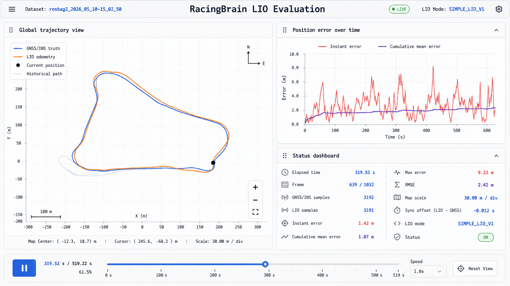

# RacingBrain LIO Agent Brief

This file is for Codex-like coding agents. It is not a user-facing README, a
research proposal, or a place to write project plans. Your job is to make the
project produce a usable LIO result, evaluate it against GNSS/INS truth, and
leave behind executable code and commands.

## Mission

Implement, tune, or replace a simple and controllable LIO pipeline whose pose
output fits the GNSS/INS pose as closely as possible.

In this project, the GNSS/INS pose is treated as the true vehicle pose and the
GNSS/INS trajectory is treated as the true trajectory. LIO quality is judged by
how well the LIO trajectory matches that truth.

Prefer a transparent implementation over a complex black box. A useful solution
can be simple if it is easy to inspect, tune, and diagnose:

- LiDAR preprocessing should be explicit and adjustable.
- IMU use should be understandable, such as initialization, attitude/motion
  prediction, deskew support, or short-stage assistance.
- LiDAR odometry should remain the main object being evaluated.
- GNSS/INS may be used for initial pose/yaw alignment and carefully bounded
  special-stage assistance.
- GNSS/INS must always be used for final evaluation.

Avoid creating unrelated documents, PPTs, reports, duplicate READMEs, or
planning-only artifacts. Keep work focused on executable LIO code, evaluation
scripts, result HTML, and the minimal command surface needed to reproduce them.

## Current Dataset

Primary dataset:

```bash
/media/yupeng/S11/rosbag2_2026_05_10-15_02_50
```

Before blaming the algorithm, evaluate whether the dataset can support LIO:

- Confirm LiDAR, IMU, and GNSS/INS topics exist and contain enough messages.
- Check timestamps, frequency, gaps, and whether replay runs to completion.
- Check coordinate frame conventions and initial alignment.
- Check whether GNSS/INS has discontinuities or obvious invalid states.
- Check whether vehicle motion provides enough excitation for LiDAR odometry.

The GNSS/INS device documentation may be useful for field definitions, status
bits, coordinate conventions, heading/yaw interpretation, and time sync:

```bash
/media/yupeng/新加卷/0-3-Projects/AutoElec/ADAS-Project/共迹A602组合定位设备资料
```

## Expected LIO Direction

The preferred first target is a simple, controllable LIO baseline rather than a
large opaque framework. Good candidates include:

- A lightweight LiDAR odometry loop with IMU-assisted initialization/prediction.
- Scan-to-scan or scan-to-map matching with explicit downsampling/cropping.
- A local map that is small enough to debug and fast enough to replay.
- GNSS/INS initialization to put LIO into the truth coordinate frame.
- Clear output topics or files for LIO pose samples.

Do not hide a bad LIO result by continuously injecting GNSS/INS as the main
pose source. If GNSS/INS is used beyond initialization, document exactly when
and why, and still report the LIO-vs-truth error.

## Evaluation Output

The final evaluation should produce a dynamic HTML result, similar in interaction
style to the existing SLAM mapping demo. It should show:

- GNSS/INS truth trajectory and LIO trajectory on the same global map.
- A current-time marker so playback shows both trajectories growing over time.
- A time slider, play/pause, speed selector, and reset-view control.
- A draggable and zoomable global map.
- A zoom range large enough to zoom far out and see the complete trajectory.
- Instantaneous position error over time.
- Cumulative mean position error over time.
- A compact numeric status panel with only values the pipeline actually has.

Reference layout only:



The image above is a layout reference, not a strict data contract. Do not force
the final HTML to reproduce fields that the LIO pipeline does not produce. Keep
the same overall structure: one large global trajectory panel, one error-curve
panel with instant and cumulative-mean error curves, and one numeric panel.

## Recommended HTML Shape

Use a single self-contained HTML file when possible. It should embed the sampled
trajectory/error data as JSON and run without a server.

Minimum data per synchronized sample:

```json
{
  "t": 12.34,
  "gnss": {"x": 1.0, "y": 2.0, "yaw": 0.1},
  "lio": {"x": 0.9, "y": 2.2, "yaw": 0.08},
  "error_m": 0.22,
  "mean_error_m": 0.15
}
```

The HTML should compute or display:

- sample count
- elapsed time
- current GNSS/INS x/y
- current LIO x/y
- current position error
- cumulative mean position error
- max position error
- RMSE, if enough synchronized samples exist

If yaw error is reliable, it may be added. If yaw conventions are uncertain, do
not pretend it is valid; explain the uncertainty in the generated result or
evaluation summary.

## Success Criteria

A useful agent run should leave the project in a state where another agent can:

1. Run the LIO pipeline on the dataset.
2. Generate synchronized LIO and GNSS/INS trajectory samples.
3. Open a dynamic HTML showing both trajectories and the two error curves.
4. Read quantitative error results.
5. Know whether remaining error is caused by algorithm limitations, parameter
   choices, integration bugs, or dataset problems.

Strong results are not defined by appearance. They are defined by lower error
against GNSS/INS truth, stable replay, and clear diagnosis.

## Existing Useful Commands

Current SLAM mapping demo command in the root README:

```bash
DATASET_DIR=/media/yupeng/S11/rosbag2_2026_05_10-15_02_50 OUTPUT_HTML=/home/yupeng/GitHub/RacingBrain/results/slam_mapping_2026_05_10-15_02_50.html RUN_DURATION_SEC=full BAG_RATE=1.0 ./scripts/run_dataset_slam_html.sh
```

Existing result viewer command:

```bash
xdg-open /home/yupeng/GitHub/RacingBrain/results/slam_mapping_2026_05_10-15_02_50.html
```

These commands are examples of the desired reproducibility style. A future LIO
evaluation command should be similarly complete and should write an HTML result
under `results/`.
